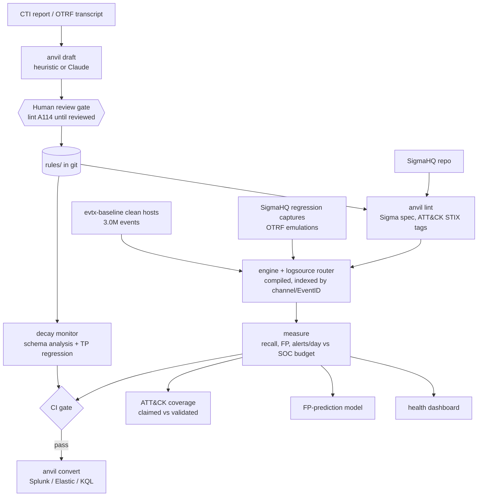

# ANVIL: detection-as-code, measured on real telemetry

[](https://github.com/rakshit-737/anvil/actions/workflows/ci.yml)
[](https://github.com/rakshit-737/anvil/actions/workflows/bench.yml)
[](https://rakshit-737.github.io/anvil/)

[](LICENSE)


<!-- --8<-- [start:pitch] -->
**ANVIL predicts, without attack data, which Sigma detections a telemetry change will silently break. It checks each rule's condition for satisfiability against the field inventory observed per log source. Under a Sysmon-to-Security-4688 migration it flags 95% of the rules that really stop firing at 100% precision, where field-presence (schema) validation reaches only 42% precision.**

Around that core it is an open, SIEM-free CI for Sigma: every rule is linted, replayed on real attack captures and on real clean-host telemetry, gated on a SOC alert budget, and cross-checked against a real OpenSearch backend.
<!-- --8<-- [end:pitch] -->

Documentation: **https://rakshit-737.github.io/anvil/** · [How it works](https://rakshit-737.github.io/anvil/how-it-works/) · [Evaluation](https://rakshit-737.github.io/anvil/evaluation/) · [Reproduce](https://rakshit-737.github.io/anvil/reproduce/)

[](https://rakshit-737.github.io/anvil/dashboard.html)

<!-- --8<-- [start:headline] -->
| Headline (real data, one CI run; Wilson 95% CIs) | Result |
| --- | --- |
| Decay monitor: Sysmon removed, process creation from 4688 only | **109/115 broken rules flagged statically: recall 94.8% [89.1, 97.6], precision 100% [96.6, 100]**. Field presence: precision 41.9% [36.2, 47.9] |
| Decay monitor: pipeline renamed fields to ECS | 426/430 flagged, recall 99.1% [97.6, 99.6], precision 100% |
| TP replay on SigmaHQ regression captures (463 cases) | 463/463, [99.2, 100]%, vs 90.7% for the 0.1 baseline and 99.6% for pySigma -> SQLite |
| Benign replay: 2,994,137 events from 3 clean Windows hosts x 2,789 observable rules | 75 rules fire; **12 exceed 20 alerts per host-day** (41 at 10 hosts, all 75 at 100) |
| OTRF Windows emulations (98 datasets) | technique detected in **62/98, 63% [53, 72]** (any alert 95/98) |
| Linux and AWS CloudTrail captures (168 labelled; Splunk attack_data + OTRF) | technique detected 27/168, 16% [11, 22]; any alert 89/168 |
<!-- --8<-- [end:headline] -->

---

## Contents
[Try it in 60 seconds](#try-it-in-60-seconds) · [Architecture](#architecture) · [Results](#results-on-real-data) · [Comparison](#comparison-with-reference-and-published-numbers) · [Datasets](#datasets) · [Reproduce](#reproduce-the-benchmarks) · [CLI](#cli) · [Prior art](#prior-art-and-how-anvil-differs) · [Limitations](#limitations) · [Roadmap](#roadmap) · [Safety](#safety)

<!-- --8<-- [start:try] -->
## Try it in 60 seconds

```bash
git clone --depth 1 https://github.com/rakshit-737/anvil && cd anvil
python -m venv .venv && . .venv/bin/activate      # Windows: .venv\Scripts\activate
pip install -e .                                   # core needs only PyYAML
anvil synth                                        # synthetic benign telemetry
anvil test                                         # -> test: 5/5 rules passed the gate
anvil test --rules examples/noisy                  # -> FAIL ... 719 alerts/day: the SOC budget blocks it
anvil draft examples/cti/fin_x_report.md           # -> 4 drafted rules in drafts/, reviewed: false
anvil lint --rules drafts --profile sigma          # -> lint: 4 rule(s), 4 finding(s), FAIL (A114 review gate)
```

Or with the container image (non-root; rules and examples bundled):

```bash
docker run --rm ghcr.io/rakshit-737/anvil:latest lint --rules rules
docker run --rm -v "$PWD:/work" -w /work ghcr.io/rakshit-737/anvil:latest lint --rules my-rules
```

Development: `pip install -e ".[dev,sigma,ml]" && python -m pytest -q` (the real-data tests skip without `$ANVIL_DATA`).
<!-- --8<-- [end:try] -->

## Architecture



| Module | What it does |
| --- | --- |
| `anvil/engine.py` | Sigma engine: the value/modifier spec (`windash`, `base64offset`, `cidr`, `fieldref`, `re` flags, wildcards/escaping, `\|all`, keywords...), compiled to closures, with Aho-Corasick for large OR-lists. Unsupported features raise instead of mis-evaluating |
| `anvil/logsource.py` | Sigma `logsource` -> Windows channel + EventID (+ EventType guards, 4688 aliasing) |
| `anvil/runner.py`, `parallel.py` | Compile, route and index a whole rule library; multi-process corpus scans |
| `anvil/telemetry.py` | EVTX (pyevtx-rs / python-evtx), EVTX-JSON, OTRF zips and sharded JSONL.gz loaders; `anvil ingest` |
| `anvil/regression.py` | Replays SigmaHQ `regression_data` (real captures labelled with expected match counts) |
| `anvil/harness.py` | Per-rule TP/TN fixtures, FP rate and alerts/day vs SOC capacity (the CI gate) |
| `anvil/lint.py` | Stable finding codes; `anvil` profile (in-rule fixtures) and `sigma` profile (SigmaHQ conventions); stale ATT&CK tags; draft review gate A114 |
| `anvil/attack.py`, `coverage.py` | ATT&CK Enterprise STIX 2.1 catalog; claimed vs validated coverage; Navigator layers |
| `anvil/draft.py` | CTI -> candidate Sigma (heuristic, optional Claude, naive keyword baseline) |
| `anvil/decay.py` | Symbolic per-log-source analysis (ok / degraded / broken / source-missing) and schema-change simulators |
| `anvil/fpmodel.py` | Predicts benign-noisy rules from static features (scikit-learn) |
| `anvil/convert.py` | pySigma bridge: SIEM queries plus an independent SQLite oracle |
| `anvil/dashboard.py` | Static detection-health dashboard |

Design decisions are recorded in [docs/adr](docs/adr).

## Results on real data

All numbers come from one `bench` workflow run on a clean ubuntu runner, with fresh, checksum-verified downloads. Every results file records the git SHA, package versions and dataset pins. The full tables are in [results/SUMMARY.md](results/SUMMARY.md), and the method and definitions are on the [Evaluation](https://rakshit-737.github.io/anvil/evaluation/) page.

<!-- --8<-- [start:results] -->
### 1. Decay monitor (the novel part)

`anvil decay` checks every rule's condition for satisfiability against the field inventory observed per log source. It uses benign telemetry only, with no attack data. The ground truth is the set of TP-validated rules that really stop firing when their captures are replayed through the simulated change. The table compares it with field-presence checks (recall / precision in %, Wilson 95% CI):

| change (broken TP rules) | symbolic (ANVIL) | field presence per source | field presence global (0.1) |
| --- | --- | --- | --- |
| Sysmon removed, 4688 only (115) | **94.8 [89.1, 97.6] / 100 [96.6, 100]** | 99.1 / 41.9 [36.2, 47.9] | 94.8 / 41.0 |
| ... and 4688 command-line auditing off, fleet-wide (349) | 95.4 / 100 | 99.4 / 94.0 | 98.0 / 94.2 |
| same, off only on converted hosts (mixed inventory) | 31.2 / 100 | 72.2 / 92.6 | 70.8 / 92.9 |
| ECS field rename (430) | 99.1 / 100 | 100 / 98.9 | 100 / 98.9 |
| CommandLine dropped (234) | 94.0 / 100 | 99.6 / 94.7 | 99.6 / 94.7 |
| Hashes dropped (0) | 6 rules flagged | 47 flagged, all false alarms | 54 flagged |

The symbolic check raised no false alarm on any TP-validated rule. Presence checks catch slightly more broken rules, but when a change removes a whole source rather than one field, most of what they flag is noise. The symbolic check's weakness is the fleet-union inventory: when only some hosts change (the mixed row), the union still contains the field. On unchanged telemetry, 183 rules (6.4%) are already broken or have no source; they are reported separately as the false-alarm floor.

### 2. TP replay (recall) on SigmaHQ regression captures

| engine | detected | missed | could not evaluate | detection rate |
| --- | ---: | ---: | ---: | ---: |
| **ANVIL engine (1.x)** | 463 | 0 | 0 | **100% [99.2, 100]** |
| ANVIL 0.1 (frozen baseline) | 420 | 14 | 29 | 90.7% |
| pySigma -> SQLite (independent condition/value semantics on ANVIL-routed events) | 461 | 1 | 1 | 99.6% |

This only measures recall, and it was the development acceptance set: most captures hold a single event, so over-matching can barely be detected here. The benign replay and the OpenSearch cross-check test the other direction. On an 1,800-event benign sample, log-source routing cuts rule evaluations from 5.15M to 44k, and alerts from 163 (16 rules) to 15 (2 rules).

### 3. False positives on clean Windows hosts (evtx-baseline)

The corpus has 2,994,137 events from three hosts (Win10, Win11, Server 2022 AD), covering 2.55 host-days. The budget lets a rule use 10% of a 200 alerts/day SOC, i.e. 20 alerts per **host-day**. When the per-host rate is projected to a fleet, the number of rules over budget grows:

| hosts | 1 | 3 | 10 | 100 |
| --- | ---: | ---: | ---: | ---: |
| rules over budget (of 75 firing) | 12 | 26 | 41 | 75 |

No `critical` rule fired, and 5 of the 1,353 `high` rules did. SigmaHQ's reference goodlog checker is green on the same images. Against its `known-FPs.csv`, 27 of the 29 medium+ rules that fire are listed (matched per rule; the list was also used during development). Eight non-low rules fire in ANVIL without being excused: 2 medium (PowerShell-classic `HostApplication` parsing) and 6 informational. They are listed in [SUMMARY](https://github.com/rakshit-737/anvil/blob/main/results/SUMMARY.md).


### 4. Emulated attacks and ATT&CK coverage

| corpus | captures | technique detected (exact or parent) | lenient (sibling sub-techniques credited) | any alert |
| --- | ---: | ---: | ---: | ---: |
| OTRF Windows atomic | 98 | 62, 63% [53, 72] | 69 | 95 |
| Linux auditd (Splunk attack_data, OTRF) | 65 | 8, 12% [6, 22] | - | 19 |
| Sysmon for Linux | 63 | 13, 21% [12, 32] | - | 38 |
| AWS CloudTrail | 40 | 6, 15% [7, 29] | - | 32 |

On ATT&CK Enterprise 19.2 for Windows, rule tags claim 299 of 474 techniques (63.1%). Only 164 of 474 are validated by a rule that fires on a real capture: 34.6% [30.5, 39.0]. On the APT29 evaluation captures, 111 and 117 rules fire, and they carry 69-70 distinct technique tags. That counts tags on fired rules, including rules triggered by background noise, not techniques covered.

SigmaHQ ships no correlation rules, either at the pinned commit `07ec293` (0 `correlation:` documents) or on master `330d1cf` (2026-10-02). Its 87 legacy `| count()` rules sit only in `unsupported/`, so correlation is out of scope.


### 5. Real backend: OpenSearch vs ANVIL

In the CI `backend` job, pySigma's OpenSearch Lucene backend converts each Windows rule, using pySigma's own Sysmon and Windows log-source pipelines rather than ANVIL's router. The job then runs the queries with `_search` against an OpenSearch 2.19.1 container that holds the regression captures and an 1,800-event benign sample (`results/backend_opensearch.json`).

| comparison | compared | agree | agreement |
| --- | ---: | ---: | --- |
| regression captures: verdict | 459 | 433 | 94.3% [91.8, 96.1] |
| benign sample: identical matching event set per rule | 2,838 | 2,837 | 99.96% [99.8, 100] |

All 26 regression disagreements are captures that ANVIL and SigmaHQ's expected counts say should match, but OpenSearch returns nothing:

- **8 use `|re`.** Lucene regexes must match the whole term, whereas Sigma regexes are unanchored searches, so the converted query is stricter than the rule.
- **1 uses `|cidr`** on a field indexed as keyword.
- **17 are PowerShell script-block and command-line wildcard rules.** Their cause is not yet diagnosed.

On benign data the two engines differ on one rule (OpenSearch 4 hits, ANVIL 0). 17 rules raised query errors and 4 could not be converted.

### 6. Drafter, SIEM conversion, FP prediction

| drafter on OTRF descriptions + transcripts | fires on its own emulation | fires and within budget | datasets with benign FPs | benign alerts |
| --- | ---: | ---: | ---: | ---: |
| heuristic (68 datasets) | 32/68, 47% [36, 59] | 32 | 6 | 57 |
| naive keywords (baseline, 75 datasets) | 56/75, 75% [64, 83] | 35 | 33 | 126,768 |
| hand-written SigmaHQ, same 68 (any alert / technique) | 66 / 46 | - | - | - |

Even after the budget gate, the keyword baseline yields more firing drafts (35 vs 32), at the cost of 126,768 benign alerts. That trade-off is why the human review gate exists. The LLM backend is implemented but not benchmarked, because no API key was used.

pySigma conversion of the 2,861 Windows rules succeeds for 99.9% on Splunk, 99.8% on Elastic, 99.3% on SQLite and 72.5% on Microsoft XDR KQL. For KQL, 632 rules have a log source with no XDR table and 119 use fields the pipeline cannot map.

FP prediction from static rule features (75 noisy rules of 2,789): logistic regression reaches ROC-AUC 0.831 and GBDT PR-AUC 0.209. A one-line `level` heuristic scores ROC-AUC 0.853 and PR-AUC 0.172. A paired bootstrap over rules puts the PR-AUC difference against the heuristic at [-0.051, 0.083] for logreg and [-0.037, 0.120] for GBDT. **With 75 positives, no scorer can be told apart from the heuristic.** Treat the models as a review-order aid only.


<!-- --8<-- [end:results] -->

<!-- --8<-- [start:comparison] -->
## Comparison with reference and published numbers

Only like-for-like setups are compared. Where no comparable number exists, the table says so.

| reference | their result | ANVIL on the same input |
| --- | --- | --- |
| SigmaHQ regression CI (evtx-sigma-checker + json_matcher) at `07ec293` | all cases pass (check run green) | 463/463 |
| SigmaHQ goodlog CI on evtx-baseline win10, win11 and 2022 DC (non-low rules, known-FPs applied) | 0 unexcused rules (green) | 8 unexcused non-low rules (2 medium, 6 informational) |
| GAUNTLET (sister project), OTRF recordings detected | 69.8% [60.0, 78.1] | 69/98 lenient, 62/98 strict |
| LLM Sigma generation from CTI (AutoSigma, arXiv 2608.19011; CTI-REALM, arXiv 2603.13517) | rule validity and coverage on cloud blogs / agent tasks | not comparable: different corpora and metrics; ANVIL scores drafts by execution on their own emulation |
| AMIDES (Uetz et al., USENIX Security 2024) | evasion of process-creation rules | not comparable: it measures adversarial evasion, not benign volume or recall |
<!-- --8<-- [end:comparison] -->

## Datasets

<!-- --8<-- [start:datasets] -->
| Dataset | Used for | Size | Licence / terms |
| --- | --- | --- | --- |
| [SigmaHQ/sigma](https://github.com/SigmaHQ/sigma) @ `07ec293` | 3,757 rules; `regression_data` (463 captures); `known-FPs.csv` | 13 MB | [DRL 1.1](https://github.com/SigmaHQ/Detection-Rule-License) |
| [NextronSystems/evtx-baseline](https://github.com/NextronSystems/evtx-baseline) v0.8.5 | Benign Windows corpus (3 hosts) | 270 MB, 3.1 GB extracted | public research data |
| [OTRF Security-Datasets](https://github.com/OTRF/Security-Datasets) @ `d9d40ef` | 98 Windows atomic emulations, APT29 days 1-2 | 123 MB | MIT |
| [MITRE ATT&CK](https://github.com/mitre-attack/attack-stix-data) v19.2 STIX | Technique catalog | 54 MB | ATT&CK Terms of Use |
| [Splunk attack_data](https://github.com/splunk/attack_data) (opt-in `nixcloud`) | Linux auditd, Sysmon for Linux and CloudTrail captures, labelled by technique folder | ~0.74 GB | Apache-2.0 |
| OTRF Linux / AWS / Log4Shell captures (opt-in `nixcloud`) | Linux and cloud emulations | small | MIT |

`all` downloads about 0.46 GB and needs about 4 GB of free disk after extraction and ingest. `nixcloud` is opt-in and runs in CI. Every download is pinned and SHA-256-verified, failing closed (`scripts/checksums.sha256`), and nothing is committed. Endpoint AV on the development laptop quarantines two OTRF archives and two regression captures. They are skipped locally and computed in the CI benchmark run, which asserts that every input was readable.
<!-- --8<-- [end:datasets] -->

## Reproduce the benchmarks

The easiest route is `gh workflow run bench.yml` (about 25 minutes), then downloading the `bench-results` artefact. To run it locally:

```bash
pip install -e ".[dev]" -r requirements-bench.txt
export ANVIL_DATA=$PWD/data                   # PowerShell: $env:ANVIL_DATA="$PWD\data"
python scripts/download_data.py all           # ~0.46 GB, pinned + checksummed
python -m anvil ingest --benign               # EVTX -> 31 JSONL.gz shards
python benchmarks/bench.py all --workers 4    # stages can also run one by one
```

Per-stage outputs and runtimes are on the [Reproduce](https://rakshit-737.github.io/anvil/reproduce/) page.

## CLI

<!-- --8<-- [start:cli] -->
| Command | Purpose |
| --- | --- |
| `anvil lint [--profile sigma] [--attack STIX] [--summary]` | Validate rules; SigmaHQ-style or ANVIL-style |
| `anvil test` | Per-rule fixtures + benign FP corpus + SOC budget gate (exit 1 on failure) |
| `anvil scan --rules DIR... --corpus PATH...` | Route a whole library over real telemetry (EVTX, JSON, OTRF zip, JSONL.gz, auditd, CloudTrail) |
| `anvil regress --sigma PATH` | Replay SigmaHQ regression captures |
| `anvil ingest SRC... --out DIR` / `--benign` | Normalise telemetry into sharded JSONL.gz |
| `anvil draft REPORT [--backend heuristic/llm/keywords]` | Draft candidate rules from CTI (review required) |
| `anvil convert RULE --target splunk/elastic/kusto/sqlite` | Deployable SIEM queries via pySigma |
| `anvil coverage [--attack STIX --platform Windows] [--navigator out.json]` | ATT&CK coverage, claimed vs validated |
| `anvil decay [--routed] [--baseline b.json]` | Schema drift, symbolic breakage, regressions |
| `anvil score` | 0-100 quality score per rule |
| `anvil synth [--schema v1/v2] [-n N] [--seed S]` | Synthetic benign telemetry for the demo |
| `anvil report` | Static health dashboard from `results/*.json` |
<!-- --8<-- [end:cli] -->

## Prior art and how ANVIL differs

<!-- --8<-- [start:prior] -->
| Existing | What it gives you | What ANVIL adds |
| --- | --- | --- |
| [Sigma](https://github.com/SigmaHQ/sigma) + [pySigma](https://github.com/SigmaHQ/pySigma) | Rule format, conversion | Local evaluation without a SIEM, benign-FP and budget gating, decay monitoring, drafting; pySigma is used for conversion and as a cross-check |
| SigmaHQ CI (evtx-sigma-checker, regression tests) | TP replay and goodlog checks for the SigmaHQ repo | The same idea as a reusable tool for your own rules and telemetry, plus budgets, validated coverage and decay analysis |
| [Elastic detection-rules](https://github.com/elastic/detection-rules) schema validation | Query fields validated against ECS / integration schemas | Condition-level satisfiability against the *observed* per-source inventory; on a source migration this keeps precision at 100%, where presence checks fall to 42% |
| Splunk ESCU + Atomic Red Team | Tested content for one platform | Backend-agnostic measurement; emulation output is an input, not a dependency |
| [Chainsaw](https://github.com/WithSecureLabs/chainsaw), [Hayabusa](https://github.com/Yamato-Security/hayabusa), [Zircolite](https://github.com/wagga40/Zircolite) | Fast Sigma hunting over EVTX | Lifecycle: gates, claimed-vs-validated coverage, decay, drafting |
<!-- --8<-- [end:prior] -->

## Limitations

<!-- --8<-- [start:limits] -->
- **Engine scope.** `expand` placeholders, aggregations and correlations are not evaluated. That affects 2 of the 3,757 rules; the 23-rule `rules-placeholder` folder is excluded up front. Linux and AWS routing is new in 1.1 (ADR 0007). Azure/M365 is not routed.
- **Benign corpus.** The three hosts are clean lab installs. Real fleets are noisier, so benign counts are a lower bound. Rates are per host-day. There is no benign CloudTrail corpus, and the benign Linux sample recorded on the CI runner lasts minutes: it is a parser smoke test, not an FP rate.
- **Coarse labels.** OTRF and Splunk captures are labelled per technique and include background noise. "Technique detected" means a rule tagged with the technique or its parent fired.
- **Drafter evaluation is optimistic by construction**, because drafts are tested on the dataset they were drafted from. The LLM backend is not benchmarked.
- **The decay inventory is a fleet union**, which hides changes that reach only some hosts (the mixed row in the decay table).
- **History.** Two synthetic telemetry files over 1 MB remain in early git history (removed in `c8cf57f`); history is not rewritten.
- **Timings** come from shared machines; treat throughput as indicative.
<!-- --8<-- [end:limits] -->

## Roadmap

- Scheduled decay job that opens an issue with the symbolic diff
- Per-host field inventories for partial rollouts
- Benchmark the LLM drafter (needs an API key) with blind human review
- Benign CloudTrail corpus; Azure/M365 routing
- GAUNTLET integration: pull emulation captures per technique and push validated coverage back

## Safety

ANVIL is defensive and lab-only. It reads logs; it never executes attack techniques, and it contains no exploit code or malware. The datasets are public log captures, never binaries, and are fetched to a git-ignored folder. YAML is loaded with safe loaders, and conditions are parsed by a recursive-descent parser, never `eval`. See [THREAT_MODEL.md](THREAT_MODEL.md) and [SECURITY.md](SECURITY.md).

## Licence

MIT for the ANVIL code ([LICENSE](LICENSE)). Rules and datasets remain under their own licences (table above). SigmaHQ content is not redistributed here.
