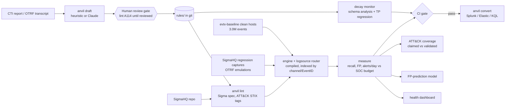

# ANVIL: detection-as-code, measured on real telemetry

[](https://github.com/rakshit-737/anvil/actions/workflows/ci.yml)
[](https://rakshit-737.github.io/anvil/)

[](LICENSE)


**ANVIL lints, replays, measures, drafts and decay-monitors Sigma detections.** The rules are treated like code: every one is checked against real attack captures, real clean-host telemetry and a SOC alert budget before it ships, and re-checked when the telemetry underneath it changes.

Documentation: **https://rakshit-737.github.io/anvil/** (with the static [health dashboard demo](https://rakshit-737.github.io/anvil/demo/)).

It is the "factory" half of a detection pipeline: a CTI report becomes a drafted rule, a human reviews it, CI tests it on emulated and benign telemetry, the rule is versioned and deployed, and a monitor watches it decay. All of it runs offline on a laptop.

| Headline (real data) | Result |
| --- | --- |
| SigmaHQ regression captures replayed (463 cases, 497 real events) | **461/461 evaluable detected (100%)** vs 90.7% for the 0.1 engine baseline and 99.1% for pySigma -> SQLite |
| Benign replay: 2,994,137 events (2.55 days, Win10 + Win11 + Server 2022 AD) x 2,803 observable Windows rules | 78 rules fire, **12 blocked** by the 20 alerts/day budget; 27 of 32 medium+ firers are on SigmaHQ's own `known-FPs.csv` |
| OTRF emulations (96 datasets, 752k events) | technique detected in **67/96** (any alert on 93) |
| ATT&CK Enterprise 19.2, Windows (474 techniques + sub-techniques) | **63.1% claimed** by tags, **34.6% validated** on real captures |
| Decay monitor, "pipeline moved to ECS field names" | 425 of 428 broken TP rules flagged statically (99% recall, 100% precision) |

---

## Contents
[Architecture](#architecture) · [Results](#results-on-real-data) · [Datasets](#datasets) · [Quickstart](#quickstart) · [Reproduce](#reproduce-the-benchmarks) · [CLI](#cli) · [Prior art](#prior-art-and-how-anvil-differs) · [Limitations](#limitations) · [Roadmap](#roadmap) · [Safety](#safety)

## Architecture



| Module | What it does |
| --- | --- |
| `anvil/engine.py` | Sigma engine: the value/modifier spec (`windash`, `base64offset`, `cidr`, `fieldref`, `re` flags, wildcards/escaping, `\|all`, keywords...), compiled to closures, with Aho-Corasick for large OR-lists. Unsupported features raise instead of mis-evaluating |
| `anvil/logsource.py` | Sigma `logsource` -> Windows channel + EventID (+ EventType guards, 4688 aliasing) |
| `anvil/runner.py`, `parallel.py` | Compile, route and index a whole rule library; multi-process corpus scans |
| `anvil/telemetry.py` | EVTX (pyevtx-rs / python-evtx), EVTX-JSON, OTRF zips and sharded JSONL.gz loaders; `anvil ingest` |
| `anvil/regression.py` | Replays SigmaHQ `regression_data` (real captures labelled with expected match counts) |
| `anvil/harness.py` | Per-rule TP/TN fixtures, FP rate and alerts/day vs SOC capacity (the CI gate) |
| `anvil/lint.py` | Stable finding codes; `anvil` profile (in-rule fixtures) and `sigma` profile (SigmaHQ conventions); stale ATT&CK tags; draft review gate A114 |
| `anvil/attack.py`, `coverage.py` | ATT&CK Enterprise STIX 2.1 catalog; claimed vs validated coverage; Navigator layers |
| `anvil/draft.py` | CTI -> candidate Sigma (heuristic, optional Claude, naive keyword baseline) |
| `anvil/decay.py` | Symbolic per-log-source analysis (ok / degraded / broken / source-missing) and schema-change simulators |
| `anvil/fpmodel.py` | Predicts benign-noisy rules from static features (scikit-learn) |
| `anvil/convert.py` | pySigma bridge: SIEM queries plus an independent SQLite oracle |
| `anvil/dashboard.py` | Static detection-health dashboard |

Design decisions are recorded in [docs/adr](docs/adr).

## Results on real data

All numbers below come from `python benchmarks/bench.py all` on the pinned datasets. The full tables are in [results/SUMMARY.md](results/SUMMARY.md) and the raw JSON is in [results/](results). The dashboard is [docs/dashboard.html](docs/dashboard.html).

### 1. Engine fidelity vs baselines (SigmaHQ `regression_data`)

| engine | detected | missed | could not evaluate | detection rate |
| --- | ---: | ---: | ---: | ---: |
| **ANVIL 0.2** | 461 | 0 | 0 | **100.0%** |
| ANVIL 0.1 (frozen baseline, `benchmarks/baselines/engine_v01.py`) | 418 | 14 | 29 | 90.7% |
| pySigma -> SQLite (independent oracle) | 457 | 2 | 2 | 99.1% |

2 of 463 captures were quarantined by local AV and are excluded. ANVIL and the pySigma oracle agree on 457 cases; the two disagreements are cases where SigmaHQ expects a match and only ANVIL produces it. On a 1,800-event benign sample, log-source routing cuts rule evaluations from 5.15M (0.1, every rule sees every event) to 44k and alerts from 164 to 15.

### 2. False positives on clean Windows hosts (evtx-baseline)

2,994,137 events, 2.55 days, 31 shards, 414.6M rule evaluations at ~303 events per CPU-second (pure Python). Policy: a rule may use at most 10% of a 200 alerts/day SOC, i.e. 20/day.

| folder | observable rules | fired | fired % | over budget |
| --- | ---: | ---: | ---: | ---: |
| core | 2,365 | 55 | 2.3% | 5 |
| emerging-threats | 317 | 3 | 0.9% | 1 |
| threat-hunting | 121 | 20 | 16.5% | 6 |

Noisiest rules: *Scheduled Task Created - Registry* (2,161/day), *Shell Context Menu Command Tampering* (1,679/day), *EVTX Created In Uncommon Location* (343/day). No `critical` rule fired, and only 7 of 1,357 `high` rules did. Of the 32 medium+ rules that fired, 27 are already on SigmaHQ's own goodlog `known-FPs.csv`, which is an external check on the replay.


### 3. Emulated attacks (OTRF Security-Datasets) and ATT&CK coverage

| view (Enterprise 19.2, Windows, 474 techniques) | covered | % | parent techniques |
| --- | ---: | ---: | ---: |
| claimed (a rule carries the tag) | 299 | 63.1% | 137/176 |
| validated (a tagged rule fires on a real capture) | 164 | 34.6% | 89/176 |

The OTRF APT29 evaluation captures raise 3,765 (day 1, 111 rules) and 4,723 (day 2, 117 rules) alerts covering 69-70 techniques. Coverage exports as an ATT&CK Navigator layer (`results/navigator_sigmahq_windows.json`).


### 4. Decay monitor under realistic telemetry changes

| simulated change | TP rules that stop firing | flagged statically | recall | precision |
| --- | ---: | ---: | ---: | ---: |
| SIEM pipeline renamed fields to ECS | 428 | 425 | 99% | 100% |
| Sysmon removed, process creation from Security 4688 only | 115 | 110 | 96% | 100% |
| ... and 4688 command-line auditing off | 349 | 110 | 32% | 100% |
| CommandLine field dropped | 234 | 220 | 94% | 100% |

The static analysis needs no attack telemetry. The 4688-without-command-line case is its known weakness: the 4688 schema still defines `CommandLine`, so the symbolic check cannot tell that auditing was switched off. The TP regression replay catches it, but only 16% of the library has TP evidence to replay, which is why both layers exist.

### 5. Drafter (CTI text -> rule -> tested), SIEM conversion, FP prediction

| drafter backend on 98 OTRF descriptions + attacker transcripts | drafts | fires on its own emulation | datasets with benign FPs | benign alerts |
| --- | ---: | ---: | ---: | ---: |
| **heuristic** (process/cmdline/registry extraction) | 90 on 68 datasets | 30 (44%) | 6 | 57 |
| naive keywords (baseline) | 75 on 75 datasets | 55 (73%) | 33 | 126,768 |

The keyword baseline "detects" more but would flood a SOC; the heuristic drafts are quiet but miss more often. Hand-written SigmaHQ rules detect the technique on 47 of the same 68 datasets. That gap is the case for the human review gate.

pySigma conversion of the 2,861 Windows rules: Splunk 99.9%, Elastic 99.8%, SQLite 99.3%, Microsoft XDR KQL 72.5% (751 rules use fields that pipeline cannot map).

FP prediction from static rule features (5-fold CV repeated over 10 seeds, mean [95% CI], 78 noisy of 2,803): logistic regression ROC-AUC 0.826 [0.818, 0.834] / PR-AUC 0.188 [0.176, 0.199], gradient boosting 0.817 [0.808, 0.825] / 0.229 [0.211, 0.248], against 0.512 [0.487, 0.538] / 0.031 for random. The single-seed numbers published in 0.2.0 (logreg 0.84 / 0.20) were slightly optimistic. A one-line heuristic (rule `level`) scores ROC-AUC 0.837 and precision at 78 of 0.42 vs 0.25-0.29 for the models, so the models only win on PR-AUC; they are a review-order aid and no more than that.


## Datasets

| Dataset | Used for | Size | Licence / terms |
| --- | --- | --- | --- |
| [SigmaHQ/sigma](https://github.com/SigmaHQ/sigma) @ `07ec293` | 3,757 rules under test; `regression_data` (463 real EVTX captures with expected match counts); `known-FPs.csv` cross-check | 13 MB zip | [Detection Rule License 1.1](https://github.com/SigmaHQ/Detection-Rule-License) |
| [NextronSystems/evtx-baseline](https://github.com/NextronSystems/evtx-baseline) v0.8.5 | Benign corpus: clean Windows 10 client, Windows 11 client, Server 2022 domain controller | 270 MB tgz, 2.99M events | Public research data (see repository) |
| [OTRF Security-Datasets](https://github.com/OTRF/Security-Datasets) @ `d9d40ef` | 98 atomic Windows host emulations with ATT&CK labels and attacker transcripts; APT29 evaluation days 1-2 | 66 MB | MIT |
| [MITRE ATT&CK Enterprise](https://github.com/mitre-attack/attack-stix-data) v19.2 STIX 2.1 | Technique catalog (697 active, 474 on Windows), revocations | 54 MB | [ATT&CK Terms of Use](https://attack.mitre.org/resources/legal-and-branding/terms-of-use/) |

Downloads are pinned and SHA-256-verified (`scripts/checksums.sha256`) and are never committed. Two OTRF archives could not be read on the development machine because endpoint AV quarantined them. They are attack *logs*, and ANVIL counts and skips such files.

## Quickstart

```bash
git clone https://github.com/rakshit-737/anvil && cd anvil
pip install -e ".[dev]"          # core needs only PyYAML
python -m pytest -q              # offline suite; real-data tests skip without $ANVIL_DATA

# the original lifecycle demo on bundled rules + synthetic telemetry
python -m anvil synth
python -m anvil lint
python -m anvil test --capacity 200 --share 0.1 --save-baseline telemetry/baseline.json
python -m anvil test --rules examples/noisy                 # FP / SOC-budget guardrail blocks this rule
python -m anvil draft examples/cti/fin_x_report.md          # drafts land in drafts/, reviewed: false
python -m anvil lint --rules drafts --profile sigma         # A114: unreviewed drafts cannot ship
```

`make` targets (`make test`, `make data`, `make bench`, `make demo`) wrap the same commands. On Windows without `make`, run them directly.

## Reproduce the benchmarks

```bash
pip install -e ".[dev]" -r requirements-bench.txt
export ANVIL_DATA=$PWD/data                   # PowerShell: $env:ANVIL_DATA="$PWD\data"
python scripts/download_data.py all           # ~350 MB, pinned + checksummed
python -m anvil ingest --benign               # EVTX -> 31 JSONL.gz shards (2,994,137 events)
python benchmarks/bench.py all --workers 4    # ~1-2 h on a laptop; stages can run separately
```

Stages: `lint engine fp otrf coverage decay convert fpmodel draft report`. Each writes `results/<stage>.json`, and `report` regenerates `results/SUMMARY.md`, `docs/img/*.png` and `docs/dashboard.html`.

## CLI

| Command | Purpose |
| --- | --- |
| `anvil lint [--profile sigma] [--attack STIX] [--summary]` | Validate rules; SigmaHQ-style or ANVIL-style |
| `anvil test` | Per-rule fixtures + benign FP corpus + SOC budget gate (exit 1 on failure) |
| `anvil scan --rules DIR... --corpus PATH...` | Route a whole library over real telemetry (EVTX, JSON, OTRF zip, JSONL.gz) |
| `anvil regress --sigma PATH` | Replay SigmaHQ regression captures |
| `anvil ingest SRC... --out DIR` / `--benign` | Normalise telemetry into sharded JSONL.gz |
| `anvil draft REPORT [--backend heuristic\|llm\|keywords]` | Draft candidate rules from CTI (review required) |
| `anvil convert RULE --target splunk\|elastic\|kusto\|sqlite` | Deployable SIEM queries via pySigma |
| `anvil coverage [--attack STIX --platform Windows] [--navigator out.json]` | ATT&CK coverage, claimed vs validated |
| `anvil decay [--routed] [--baseline b.json]` | Schema drift, symbolic breakage, regressions |
| `anvil score` | 0-100 quality score per rule |
| `anvil report` | Static health dashboard from `results/*.json` |

## Prior art and how ANVIL differs

| Existing | What it gives you | What ANVIL adds |
| --- | --- | --- |
| [Sigma](https://github.com/SigmaHQ/sigma) + [pySigma](https://github.com/SigmaHQ/pySigma) / sigma-cli | Rule format, conversion to SIEM queries | Local evaluation without a SIEM, benign-FP and alert-budget gating, decay monitoring, drafting. ANVIL uses pySigma for conversion and as a cross-check |
| SigmaHQ CI ([evtx-sigma-checker](https://github.com/NextronSystems/evtx-baseline), regression tests) | TP replay and goodlog checks for the SigmaHQ repo | The same idea as a reusable tool for *your* rules and *your* telemetry, plus volume budgets, coverage validation and decay analysis. ANVIL reproduces SigmaHQ's own regression verdicts (461/461 evaluable cases) and cross-checks against its known-FP list |
| [Elastic detection-rules](https://github.com/elastic/detection-rules), Splunk ESCU + Atomic Red Team | Versioned, tested content for one platform | Backend-agnostic measurement and an alert-budget gate; emulation output is an input, not a dependency |
| [Chainsaw](https://github.com/WithSecureLabs/chainsaw), [Hayabusa](https://github.com/Yamato-Security/hayabusa), [Zircolite](https://github.com/wagga40/Zircolite) | Fast Sigma hunting over EVTX | Lifecycle rather than hunting: gates, claimed-vs-validated coverage, decay, drafting, FP prediction |
| Detection-as-code write-ups | Methodology | A working open reference implementation, with published numbers |

## Limitations

- **Engine scope.** Placeholders (`expand`), aggregations and correlation rules are not evaluated. They are reported as unsupported (2 of 3,757 rules at the pinned commit). Field-name semantics follow Sysmon/Windows event logs; other products need a mapping.
- **Benign corpus.** evtx-baseline hosts are clean lab installs. Real fleets are noisier, so treat benign alert counts as a lower bound and replay your own telemetry before trusting absolute volumes. The alerts/day figures assume the corpus's own time span.
- **Emulation labels are coarse.** OTRF datasets are labelled at technique level and include background noise. "Technique detected" means a rule tagged with that technique (or its parent) fired on the capture, not that a human verified the alert.
- **Drafter evaluation is optimistic by construction.** Drafts are generated from the same dataset's description and transcript that they are then tested on (report -> rule -> emulation, spec scenario 1). The LLM backend is implemented but not benchmarked here, because no API key was used for the published numbers.
- **FP-prediction labels come from one corpus family.** The model predicts "fires on these clean hosts". It is a triage aid for review order, not a replacement for replay.
- **No React UI / API server.** The spec's React review-gate and dashboard are replaced by git PR review and a static dashboard (ADR 0005), so there is no docker-compose; the Docker image ships the CLI.
- **LLM drafter not benchmarked** (needs an API key and blind human review, see roadmap).
- **Timings** were measured on a shared, heavily loaded laptop. Treat throughput numbers as indicative.

## Roadmap

- Correlation rules and `expand` placeholders through pySigma processing pipelines
- Linux (auditd, Sysmon for Linux) and cloud log-source routing
- Scheduled decay job that opens issues with the symbolic diff
- Benchmark the LLM drafter against the heuristic baseline, with blind human review
- GAUNTLET integration: pull emulation captures per technique and push validated coverage back

## Safety

ANVIL is defensive and lab-only. It reads logs; it never executes attack techniques, and it contains no exploit code or malware. The datasets are public log captures, never binaries, and are fetched to a git-ignored folder. YAML is loaded with safe loaders, and conditions are parsed by a recursive-descent parser, never `eval`. See [THREAT_MODEL.md](THREAT_MODEL.md) and [SECURITY.md](SECURITY.md).

## Licence

MIT for the ANVIL code ([LICENSE](LICENSE)). Rules and datasets remain under their own licences (table above). SigmaHQ content is not redistributed here.
