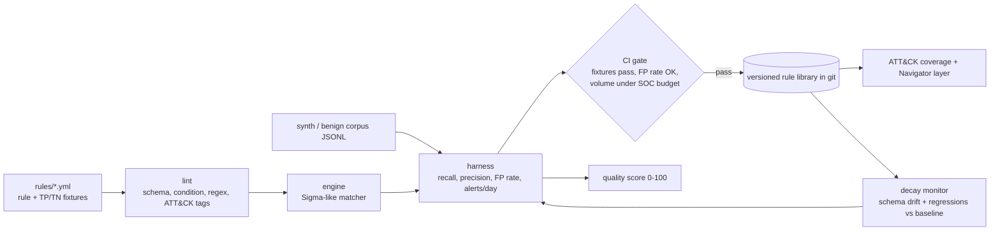

# ANVIL: detection-as-code lifecycle

Detection rules are code, so they should get linted, unit-tested, measured and regression-checked before they ship. ANVIL runs that loop for Sigma-like rules. Every rule carries its own true-positive and true-negative fixtures. Every rule is replayed against a benign telemetry corpus to count false positives. A rule is blocked if its expected alert volume would take more than its share of SOC triage capacity. A decay monitor catches rules that silently break when a log schema changes.

> Status: MVP covering the Grade A/B parts of the [ANVIL spec](../13-ANVIL.md): the detection CI, measurement and decay monitoring. The LLM drafter, real emulated telemetry and the dashboard are listed under TODO below.

## Architecture



| Module | File | What it does |
| --- | --- | --- |
| Typed models | `anvil/models.py` | `Rule`, `LogSource` and `RuleTests` dataclasses, plus ATT&CK tag parsing |
| Engine | `anvil/engine.py` | Field maps (AND), lists (OR), keywords, the `contains/startswith/endswith/re/all/exists/cased` modifiers and globs. Conditions support `and/or/not`, parentheses, `1 of x*`, `all of them`, parsed by recursive descent (no `eval`) |
| Lint | `anvil/lint.py` | Stable error (`A1xx`) and warning (`W2xx`) codes: UUID ids, level/status enums, condition parse, unused selections, bad regex, short `contains` values, missing fixtures, duplicate ids |
| Harness | `anvil/harness.py` | TP recall, TN leakage, benign-corpus FP rate, alerts/day compared with a SOC capacity budget, and a pass/fail gate |
| Coverage | `anvil/coverage.py` | Coverage against a bundled ATT&CK subset, reported per tactic and split into "validated" vs "claimed". Exports an ATT&CK Navigator layer |
| Quality | `anvil/quality.py` | Score from 0 to 100 (grades A to F) built from lint hygiene, metadata, ATT&CK mapping, test depth, recall, precision and noise |
| Decay | `anvil/decay.py` | Schema drift (fields a rule uses that no longer appear in telemetry) and regressions compared with a saved baseline (recall drop, FP spike) |
| Synth | `anvil/synth.py` | Deterministic synthetic benign process-creation telemetry, with a `v2` renamed schema for simulating drift |
| CLI | `anvil/cli.py` | `anvil lint / test / coverage / score / decay / synth` |

## Quickstart

```bash
pip install -r requirements.txt      # PyYAML + pytest only
make test                            # pytest
make demo                            # full lifecycle walk-through
# or step by step
python -m anvil synth                # telemetry/benign.jsonl (5,000 events = 1 day)
python -m anvil lint
python -m anvil test --capacity 200 --share 0.1 --save-baseline telemetry/baseline.json
python -m anvil test --rules examples/noisy          # FP guardrail blocks this rule
python -m anvil coverage --corpus telemetry/benign.jsonl --navigator layer.json
python -m anvil score
python -m anvil synth --schema v2 --out telemetry/benign_v2.jsonl
python -m anvil decay --corpus telemetry/benign_v2.jsonl   # flags schema drift
```

(Without `make` on Windows, run the commands above directly.)

The demo covers these spec scenarios:
- **#2 FP guardrail:** `examples/noisy` produces around 14% FP (about 700 alerts/day against a 20/day budget), and the gate fails.
- **#3 Decay caught:** after a schema rename, every rule is flagged.
- **#4 Coverage tie-in:** only rules that pass the gate count toward validated coverage.
- **#5 Volume sanity:** the volume sanity check is built into the gate.

### Writing a rule

Rules are Sigma-shaped YAML with an extra `tests:` block:

```yaml
detection:
  selection: { Image|endswith: '\certutil.exe', CommandLine|contains: [urlcache, verifyctl] }
  url:       { CommandLine|contains: ['http://', 'https://'] }
  condition: selection and url
tests:
  true_positives:  [ {Image: 'C:\...\certutil.exe', CommandLine: 'certutil -urlcache -f http://203.0.113.7/a.exe'} ]
  true_negatives:  [ {Image: 'C:\...\certutil.exe', CommandLine: 'certutil -verify root.cer'} ]
```

## Prior art and how this differs

| Existing | What it gives you | What ANVIL adds |
| --- | --- | --- |
| Sigma + sigma-cli / pySigma | The rule format and backend conversion | Fixtures stored in the rule, measured FP rate on a corpus, a SOC-capacity gate, and decay checks |
| Elastic detection-rules | Versioned rules with unit tests | Backend-agnostic, and its quality score combines hygiene with measured efficacy |
| Splunk ESCU / Atomic Red Team | Content plus emulation | ANVIL is the measurement and gate layer that emulation output feeds into |
| Detection-as-code blog posts | Methodology | A small working reference implementation |

ANVIL is honest about its limits. The engine is a Sigma subset, not a pySigma replacement. It evaluates rules in Python over JSONL instead of compiling them to SIEM queries. Its contribution is the integrated lint, test, measure, gate and decay loop.

## Safety

- Defensive only. ANVIL writes and measures detections. It contains no offensive tooling.
- All telemetry is synthetic (`*.lab.example` hosts, `LAB\userNN` accounts, TEST-NET IP `203.0.113.7`). TP fixtures are inert strings that describe attacker behaviour. Nothing is executed.
- No network access and no production systems are touched. YAML is loaded with `safe_load`, and conditions are parsed, never passed to `eval`.

See [THREAT_MODEL.md](THREAT_MODEL.md) and [SECURITY.md](SECURITY.md).

## TODO (Grade C/D/E items, not built)

- [ ] **LLM drafter (B/C):** CTI report to candidate rule, with a mandatory human PR review gate. The rule must pass `anvil test` before merge.
- [ ] **Emulated TP telemetry (C):** ingest Atomic Red Team / GAUNTLET range output instead of hand-written fixtures.
- [ ] **Real benign corpora (C):** Security-Datasets/Mordor and EVTX samples, with a field-mapping layer.
- [ ] **FP-rate prediction ML (C/D):** predict FP rate from rule features to prioritise review.
- [ ] **Full ATT&CK catalog:** import from MITRE STIX instead of the bundled 16-technique subset.
- [ ] **Backends:** compile rules to Splunk/Elastic/KQL (or delegate to pySigma).
- [ ] **Health dashboard (A):** React + Recharts over `anvil test --json` output, plus scheduled decay re-runs.
- [ ] Sigma features not yet supported: aggregations/`count() by`, correlations, `base64offset`, `windash`, `cidr`, field mappings/pipelines.
