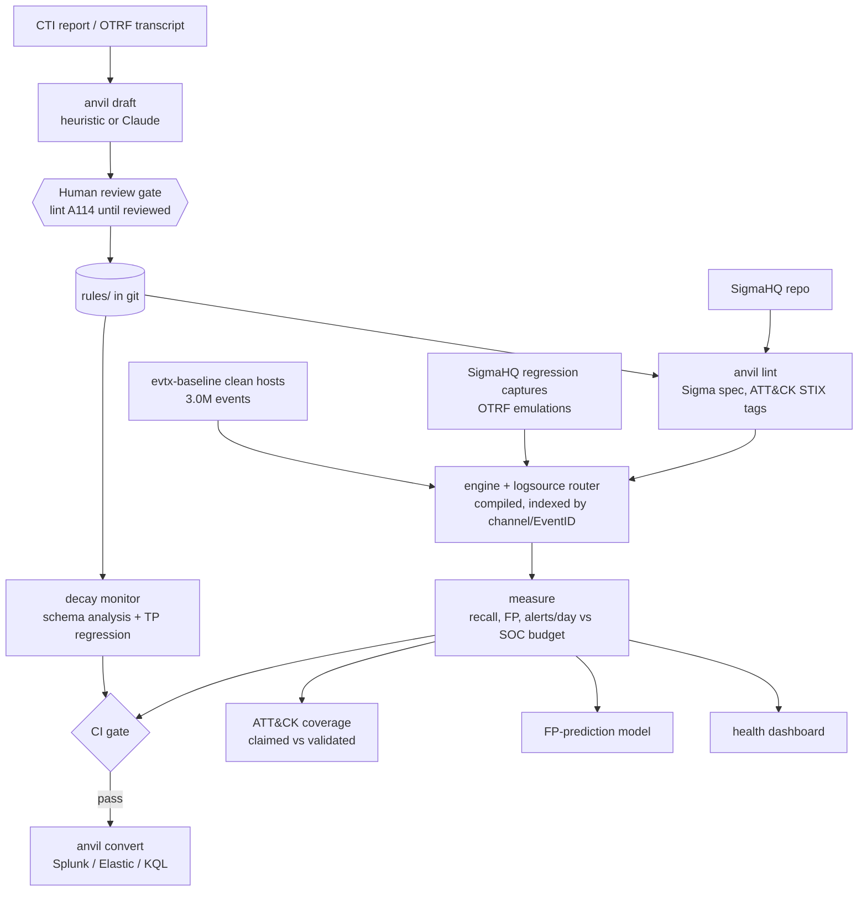

# ANVIL: detection-as-code, measured on real telemetry

[](https://github.com/rakshit-737/anvil/actions/workflows/ci.yml)
[](https://github.com/rakshit-737/anvil/actions/workflows/bench.yml)
[](https://rakshit-737.github.io/anvil/)

[](LICENSE)


<!-- --8<-- [start:pitch] -->
**ANVIL predicts from benign telemetry alone which Sigma detections a telemetry change will silently break: when Sysmon is removed from real OTRF attack captures that also log Security 4688, its per-log-source satisfiability check flags 114 of the 122 rules that stop firing with no false alarm, where field-presence (schema-style) validation raises 63.**

Around that core it is an open, SIEM-free CI for Sigma: every rule is linted, replayed on real attack captures and on real clean-host telemetry, gated on a SOC alert budget, and cross-checked against a real OpenSearch backend.
<!-- --8<-- [end:pitch] -->

Documentation: **https://rakshit-737.github.io/anvil/** · [How it works](https://rakshit-737.github.io/anvil/how-it-works/) · [Evaluation](https://rakshit-737.github.io/anvil/evaluation/) · [Reproduce](https://rakshit-737.github.io/anvil/reproduce/)

[](https://rakshit-737.github.io/anvil/dashboard.html)

<!-- --8<-- [start:headline] -->
| Headline (real data, `bench` run [37093721154](https://github.com/rakshit-737/anvil/actions/runs/37093721154) at `9906b42`; `k/n, p% [Wilson 95% CI]`) | Result |
| --- | --- |
| Decay monitor, **real**: Sysmon dropped from 88 OTRF captures that also log native 4688 | **114/122 rules that stop firing flagged statically, 93.4% [87.6, 96.6]; precision 114/114, 100% [96.7, 100]**. Field presence: precision 119/182, 65.4% [58.2, 71.9], 63 false alarms (exact McNemar p = 2.2e-19) |
| Decay monitor, simulated Sysmon-to-4688 migration on SigmaHQ regression captures | 109/115, 94.8% [89.1, 97.6]; precision 109/109, 100% [96.6, 100] (partly by construction: the same transform builds ground truth and inventory). Field presence: 114/272, 41.9% [36.2, 47.8] |
| TP replay on SigmaHQ regression captures | 463/463, 100% [99.2, 100]; 0.1 baseline 420/463, 90.7% [87.7, 93.0]; pySigma -> SQLite 461/463, 99.6% [98.4, 99.9] |
| Benign replay: 2,994,137 events from 3 clean Windows hosts | 75/2,789 observable rules fire, 2.7% [2.2, 3.4]; **12 exceed 20 alerts per host-day** (41 at 10 hosts, all 75 at 100) |
| OTRF Windows emulations | technique detected **62/98, 63.3% [53.4, 72.1]**; any alert 95/98, 96.9% [91.4, 99.0] |
| Linux and AWS CloudTrail captures (Splunk attack_data + OTRF) | technique detected 27/168, 16.1% [11.3, 22.4]; any alert 89/168, 53.0% [45.4, 60.4] |
| OpenSearch 2.19 as an independent backend | regression verdicts agree 450/458, 98.3% [96.6, 99.1] |
<!-- --8<-- [end:headline] -->

---

## Contents
[Try it in 60 seconds](#try-it-in-60-seconds) · [Architecture](#architecture) · [Results](#results-on-real-data) · [Comparison](#comparison-with-reference-and-published-numbers) · [Datasets](#datasets) · [Reproduce](#reproduce-the-benchmarks) · [CLI](#cli) · [Prior art](#prior-art-and-how-anvil-differs) · [Limitations](#limitations) · [Roadmap](#roadmap) · [Safety](#safety)

<!-- --8<-- [start:try] -->
## Try it in 60 seconds

```bash
git clone --depth 1 https://github.com/rakshit-737/anvil && cd anvil
python -m venv .venv && . .venv/bin/activate      # Windows: .venv\Scripts\activate
pip install -e .                                   # core needs only PyYAML
anvil synth                                        # synthetic benign telemetry
anvil test                                         # -> test: 5/5 rules passed the gate
anvil test --rules examples/noisy                  # -> FAIL ... 719 alerts/day: the SOC budget blocks it
anvil draft examples/cti/fin_x_report.md           # -> 4 drafted rules in drafts/, reviewed: false
anvil lint --rules drafts --profile sigma          # -> lint: 4 rule(s), 4 finding(s), FAIL (A114 review gate)
```

Or with the container image (non-root; rules and examples bundled):

```bash
docker run --rm ghcr.io/rakshit-737/anvil:v1.1.0 lint --rules rules          # or :latest
docker run --rm -v "$PWD:/work" -w /work ghcr.io/rakshit-737/anvil:v1.1.0 lint --rules my-rules
```

Development: `pip install -e ".[dev,sigma,ml]" && python -m pytest -q` (the real-data tests skip without `$ANVIL_DATA`).
<!-- --8<-- [end:try] -->

## Architecture



| Module | What it does |
| --- | --- |
| `anvil/engine.py` | Sigma engine: the value/modifier spec (`windash`, `base64offset`, `cidr`, `fieldref`, `re` flags, wildcards/escaping, `\|all`, keywords...), compiled to closures, with Aho-Corasick for large OR-lists. Unsupported features raise instead of mis-evaluating |
| `anvil/logsource.py` | Sigma `logsource` -> Windows channel + EventID (+ EventType guards, 4688 aliasing) |
| `anvil/runner.py`, `parallel.py` | Compile, route and index a whole rule library; multi-process corpus scans |
| `anvil/telemetry.py` | EVTX (pyevtx-rs / python-evtx), EVTX-JSON, OTRF zips and sharded JSONL.gz loaders; `anvil ingest` |
| `anvil/regression.py` | Replays SigmaHQ `regression_data` (real captures labelled with expected match counts) |
| `anvil/harness.py` | Per-rule TP/TN fixtures, FP rate and alerts/day vs SOC capacity (the CI gate) |
| `anvil/lint.py` | Stable finding codes; `anvil` profile (in-rule fixtures) and `sigma` profile (SigmaHQ conventions); stale ATT&CK tags; draft review gate A114 |
| `anvil/attack.py`, `coverage.py` | ATT&CK Enterprise STIX 2.1 catalog; claimed vs validated coverage; Navigator layers |
| `anvil/draft.py` | CTI -> candidate Sigma (heuristic, optional Claude, naive keyword baseline) |
| `anvil/decay.py` | Symbolic per-log-source analysis (ok / degraded / broken / source-missing) and schema-change simulators |
| `anvil/fpmodel.py` | Predicts benign-noisy rules from static features (scikit-learn) |
| `anvil/convert.py` | pySigma bridge: SIEM queries plus an independent SQLite oracle |
| `anvil/dashboard.py` | Static detection-health dashboard |

Design decisions are recorded in [docs/adr](docs/adr).

## Results on real data

<!-- --8<-- [start:results] -->
**Provenance.** Every number below comes from one `bench` workflow run, [37093721154](https://github.com/rakshit-737/anvil/actions/runs/37093721154) at commit `9906b42`, with all three jobs green (bench, OpenSearch backend, report) on clean ubuntu runners and fresh, checksum-verified downloads. The `results` artefact of that run is committed unmodified; each results file records the run id, git SHA, package versions and dataset pins, and `python benchmarks/bench.py verify` diffs a reproduction against it. Proportions are `k/n, p% [Wilson 95% CI]`; the full tables are in [results/SUMMARY.md](https://github.com/rakshit-737/anvil/blob/main/results/SUMMARY.md) and the method is on the [Evaluation](https://rakshit-737.github.io/anvil/evaluation/) page.

### 1. Decay monitor (the novel part)

`anvil decay` checks every rule's condition for satisfiability against the field inventory observed per log source. It uses benign telemetry only, with no attack data. It is compared with two field-presence checks (the per-field logic of schema validation): per log source, and global (ANVIL 0.1).


**Real change, no simulator.** 88 OTRF captures log both Sysmon EID 1 and native Security 4688. 286 Windows rules fire on them; 122 fire on none once the Sysmon channel is dropped from the real captures. The prediction comes from the benign inventory with its real Sysmon events dropped:

| method | flags on the 122 broken rules (recall) | precision | false alarms on the 164 rules that keep firing |
| --- | --- | --- | ---: |
| **symbolic (ANVIL)** | **114/122, 93.4% [87.6, 96.6]** | **114/114, 100% [96.7, 100]** | **0** |
| field presence, per source | 119/122, 97.5% [93.0, 99.2] | 119/182, 65.4% [58.2, 71.9] | 63 |
| field presence, global (0.1) | 115/122, 94.3% [88.6, 97.2] | 115/177, 65.0% [57.7, 71.6] | 62 |

Exact McNemar tests on the same rules: false alarms 0 vs 63 (p = 2.2e-19) and 0 vs 62 (p = 4.3e-19); flags on broken rules 114 vs 119 (5 discordant, p = 0.062) and 114 vs 115 (5 / 6 discordant, p = 1.0). Of the 8 misses, 3 (two WMI-event rules and one file-deletion rule) have no log source in the benign inventory even before the change, so they sit on the floor below and are not counted as worsened; 5 are process-creation rules with a selection whose fields 4688 also carries, which stop firing because the captures' 4688 events do not match them (different values, or a `field: null` filter that now excludes every event), an effect a field-level check cannot see. Labels here are "fires at all", not "detects its technique".

**Simulated changes.** Each change is applied to the TP-validated rules' SigmaHQ regression captures (ground truth) and to the benign inventory (prediction). Because the same transform builds both sides, the symbolic check's 100% precision in these rows is partly a soundness property of the transform; the real row above does not have that property. Recall / precision:

| change (broken TP rules) | symbolic (ANVIL) | field presence per source | field presence global (0.1) |
| --- | --- | --- | --- |
| Sysmon removed, 4688 only (115) | 109/115, 94.8% [89.1, 97.6] / 109/109, 100% [96.6, 100] | 114/115, 99.1% [95.2, 99.8] / 114/272, 41.9% [36.2, 47.8] | 109/115, 94.8% [89.1, 97.6] / 109/266, 41.0% [35.2, 47.0] |
| ... and 4688 command-line auditing off, fleet-wide (349) | 333/349, 95.4% [92.7, 97.2] / 333/333, 100% [98.9, 100] | 347/349, 99.4% [97.9, 99.8] / 347/369, 94.0% [91.1, 96.0] | 342/349, 98.0% [95.9, 99.0] / 342/363, 94.2% [91.3, 96.2] |
| same, off only on converted hosts (mixed inventory, 349) | 109/349, 31.2% [26.6, 36.3] / 109/109, 100% [96.6, 100] | 252/349, 72.2% [67.3, 76.6] / 252/272, 92.6% [88.9, 95.2] | 247/349, 70.8% [65.8, 75.3] / 247/266, 92.9% [89.1, 95.4] |
| ECS field rename (430) | 426/430, 99.1% [97.6, 99.6] / 426/426, 100% [99.1, 100] | 430/430, 100% [99.1, 100] / 430/435, 98.9% [97.3, 99.5] | 430/430, 100% [99.1, 100] / 430/435, 98.9% [97.3, 99.5] |
| CommandLine dropped (234) | 220/234, 94.0% [90.2, 96.4] / 220/220, 100% [98.3, 100] | 233/234, 99.6% [97.6, 99.9] / 233/246, 94.7% [91.2, 96.9] | 233/234, 99.6% [97.6, 99.9] / 233/246, 94.7% [91.2, 96.9] |
| Hashes dropped (0) | 6 rules flagged, none TP-validated | 47 flagged; 7 have TP evidence and all 7 are false alarms | 54 flagged; same 7 |

No change-induced false alarm on a TP-validated rule. Against per-source presence, the false-alarm difference is significant in every row (exact McNemar, e.g. 0 vs 158 of 345 unbroken rules, p = 5.5e-48, for the Sysmon removal), and presence catches more broken rules in the command-line rows (0 vs 14 discordant, p = 1.2e-4). The symbolic check's weakness is the fleet-union inventory: when only some hosts change (the mixed row), the union still contains the field. The 6 rules it flags for the Hashes change need `Hashes` on every path, so presence flags them too; they have no regression capture, so they are not scored. On unchanged telemetry, 183 rules (6.4%) are already broken or have no source and are reported separately as the floor; 3 of them are TP-validated (WMI Event Subscription, Important Scheduled Task Deleted/Disabled, and a RedSun EICAR rule), i.e. false alarms before any change. Per-rule flag sets and every test are in `results/decay.json`.

### 2. TP replay (recall) on SigmaHQ regression captures

| engine | detected | missed | could not evaluate | detection rate |
| --- | ---: | ---: | ---: | ---: |
| **ANVIL engine (1.x)** | 463 | 0 | 0 | **463/463, 100% [99.2, 100]** |
| ANVIL 0.1 (frozen baseline) | 420 | 14 | 29 | 420/463, 90.7% [87.7, 93.0] |
| pySigma -> SQLite (independent condition/value semantics on ANVIL-routed events) | 461 | 1 | 1 | 461/463, 99.6% [98.4, 99.9] |

This only measures recall, and it was the development acceptance set: most captures hold a single event, so over-matching can barely be detected here. The benign replay and the OpenSearch cross-check test the other direction. On an 1,800-event benign sample, the 1.x engine with log-source routing switched off raises 163 alerts from 16 rules over 5.12M rule evaluations, exactly what the 0.1 engine raises; with routing on it raises 15 alerts from 2 rules over 44k evaluations. So on this sample the whole reduction comes from routing, not from the 1.x value-semantics changes.

### 3. False positives on clean Windows hosts (evtx-baseline)

The corpus has 2,994,137 events from three hosts (Win10, Win11, Server 2022 AD), covering 2.55 host-days of install-day recordings. 75/2,789 observable rules fire, 2.7% [2.2, 3.4]. The budget lets a rule use 10% of a 200 alerts/day SOC, i.e. 20 alerts per **host-day**. When the per-host rate is projected to a fleet, the number of rules over budget grows:

| hosts | 1 | 3 | 10 | 100 |
| --- | ---: | ---: | ---: | ---: |
| rules over budget (of 75 firing) | 12 | 26 | 41 | 75 |

The noisiest rules are install-driven (scheduled-task registry writes, AppX installs, AppCompat), so these per-day rates are likely higher than a steady-state host's (see Limitations). By level: 0/128 critical, 5/1,353 high (0.4% [0.2, 0.9]), 24/1,096 medium, 40/199 low and 6/13 informational rules fire. Against SigmaHQ's `known-FPs.csv`, 27 of the 29 medium+ rules that fire are listed (matched per rule id; the list was also used during development). Eight non-low rules fire in ANVIL without an entry: 2 medium (PowerShell-classic `HostApplication` parsing) and 6 informational. SigmaHQ's goodlog CI is green on the same images, and excusing per rule id is more lenient than its MatchString filters, so these 8 are a lower bound on rules where ANVIL fires and SigmaHQ's checker does not. They are listed in [SUMMARY](https://github.com/rakshit-737/anvil/blob/main/results/SUMMARY.md).


### 4. Emulated attacks and ATT&CK coverage

| corpus | captures | technique detected (exact or parent) | lenient (sibling sub-techniques credited) | any alert |
| --- | ---: | ---: | ---: | ---: |
| OTRF Windows atomic | 98 | 62/98, 63.3% [53.4, 72.1] | 69/98, 70.4% [60.7, 78.5] | 95/98, 96.9% [91.4, 99.0] |
| Linux auditd (Splunk attack_data, OTRF) | 65 | 8/65, 12% [6, 22] | - | 19/65, 29% [20, 41] |
| Sysmon for Linux | 63 | 13/63, 21% [12, 32] | - | 38/63, 60% [48, 71] |
| AWS CloudTrail | 40 | 6/40, 15% [7, 29] | - | 32/40, 80% [65, 90] |

The CI runner also records its own telemetry (auditd and Sysmon for Linux; `scripts/record_linux_live.sh`). In a 3-second window of benign discovery-style commands, each labelled with the technique it resembles, 7/8 techniques are detected, 88% [53, 98] (T1033, T1082, T1007, T1087.001, T1057, T1016, T1083; T1027 missed: the SigmaHQ base64 rules look for decoding, piping into a shell or encoded shebangs, not for encoding a file), from 755 events and 17 alerts by 10 Linux rules. An 11-second benign developer workload on the same runner (venv, pip install, the unit tests, git; 15,480 events) fires 42 alerts from 6 Linux rules; it is far too short for a per-day rate and serves as a parser smoke test.

On ATT&CK Enterprise 19.2 for Windows, rule tags claim 299/474 techniques, 63.1% [58.6, 67.3]. Only 164/474, 34.6% [30.5, 39.0], are validated by a rule that fires on a real capture. On the APT29 evaluation captures, 111 and 117 rules fire, and they carry 69-70 distinct technique tags. That counts tags on fired rules, including rules triggered by background noise, not techniques covered.

SigmaHQ ships no correlation rules at the pinned commit `07ec293` (0 `correlation:` documents in any folder; also 0 on master `330d1cf`, 2026-10-02). Its legacy aggregations live outside the rule folders: `unsupported/` holds 87 rules, 45 with `count()` and 54 with any aggregation in the condition, plus one `count()` rule in `deprecated/` (`results/lint.json`, `aggregation_census`). Correlation is therefore out of scope.


### 5. Real backend: OpenSearch vs ANVIL

In the CI `backend` job, pySigma's OpenSearch Lucene backend converts each Windows rule, using pySigma's own Sysmon and Windows log-source pipelines rather than ANVIL's router. The job then runs the queries with `_search` against an OpenSearch 2.19.1 container that holds the regression captures and an 1,800-event benign sample (`results/backend_opensearch.json`). The container runs without a restart policy, and the job fails on a restart or any `java.lang.OutOfMemoryError` in its log.

| comparison | compared | agree |
| --- | ---: | --- |
| regression captures: verdict | 458 | 450/458, 98.3% [96.6, 99.1] |
| benign sample: identical matching event set per rule | 2,836 | 2,835/2,836, 99.96% [99.80, 99.99] |
| benign sample, only rules that fire in either engine | 3 | 2/3 |

All 8 regression disagreements are captures that ANVIL and SigmaHQ's expected counts say should match, but OpenSearch returns nothing: 7 use `|re` (Lucene regexes must match the whole term, whereas Sigma regexes are unanchored searches, so the converted query is stricter than the rule) and 1 uses `|cidr` on a field indexed as keyword. In 1.1.0 there were 26: the 17 PowerShell script-block captures then counted as undiagnosed held `ScriptBlockText` values of 11,890-19,086 characters, which the old 10,922-character `ignore_above` mapping never indexed; values are now indexed up to Lucene's 32,766-byte term limit.

On benign data the two engines differ on one rule (OpenSearch 4 hits, ANVIL 0). The 99.96% is dominated by rules that fire in neither engine: only 3 rules fire at all, and 2 of them agree exactly (Cohen's kappa 0.80, bootstrap 95% CI [0.00, 1.00], i.e. undetermined with 3 firing rules). 19 rules raise HTTP 400 query errors, all recorded with their cause in `results/backend_opensearch.json`: 14 use regex syntax Lucene rejects (`\b`, `\n`, named groups, quote characters), 3 exceed Lucene's 10,000-state regex determinization limit, and 2 are very long OR lists (npm package names, driver hashes) that fail to parse. 4 rules cannot be converted. In 1.1.0 the job's first run died with `java.lang.OutOfMemoryError` at a 2 GB heap: Sigma keyword searches have no field and were expanded over every mapped field. They now query one catch-all field, and the run above has no restart and no heap error.

### 6. Drafter, SIEM conversion, FP prediction

| drafter on OTRF descriptions + transcripts | fires on its own emulation | fires and within budget | datasets with benign FPs | benign alerts |
| --- | ---: | ---: | ---: | ---: |
| heuristic (68 datasets with a draft) | 32/68, 47% [36, 59] | 32 | 6 | 57 |
| naive keywords (baseline, 75 datasets with a draft) | 56/75, 75% [64, 83] | 35 | 33 | 126,768 |
| hand-written SigmaHQ, same 68 (any alert / technique) | 66 / 46 | - | - | - |

Paired over all 98 datasets (a dataset without a draft counts as a miss), the keyword baseline fires more often, 56 vs 32 (discordant 34 vs 10, exact McNemar p = 0.0004). After the budget gate the two cannot be told apart, 35 vs 32 of 98 (discordant 22 vs 19, p = 0.76), while the keyword drafts cost 126,768 benign alerts. On the 58 datasets where both drafted: 39 vs 22 (p = 1.5e-5) and 26 vs 22 within budget (p = 0.52). That trade-off is why the human review gate exists. The LLM backend is implemented but not benchmarked (see Limitations).

pySigma conversion of the 2,861 Windows rules succeeds for 2,857 (99.9% [99.6, 99.9]) on Splunk, 2,855 (99.8% [99.5, 99.9]) on Elastic, 2,842 (99.3% [99.0, 99.6]) on SQLite and 2,074 (72.5% [70.8, 74.1]) on Microsoft XDR KQL. For KQL, 632 rules have a log source with no XDR table and 119 use fields the pipeline cannot map.

FP prediction from static rule features (75 noisy rules of 2,789), seed-7 cross-validation with bootstrap 95% CIs over rules: logistic regression ROC-AUC 0.831 [0.776, 0.881], PR-AUC 0.178 [0.122, 0.265]; GBDT ROC-AUC 0.824 [0.768, 0.871], PR-AUC 0.209 [0.135, 0.304]. A one-line `level` heuristic scores ROC-AUC 0.853 [0.808, 0.894] and PR-AUC 0.172 [0.118, 0.243]. (Means over 10 CV seeds: logreg 0.829 / 0.183, GBDT 0.830 / 0.231.) The paired bootstrap puts the PR-AUC difference against the heuristic at [-0.051, 0.083] for logreg and [-0.037, 0.120] for GBDT. **With 75 positives, no scorer can be told apart from the heuristic.** Treat the models as a review-order aid only.


<!-- --8<-- [end:results] -->

<!-- --8<-- [start:comparison] -->
## Comparison with reference and published numbers

Each row states whether the comparison is like-for-like.

| reference | their result | ANVIL on the same input | like-for-like? |
| --- | --- | --- | --- |
| SigmaHQ regression CI at `07ec293` (evtx-sigma-checker + SigmaHQ's json_matcher v0.0.2, run as `json_checker`), run [36187990502](https://github.com/SigmaHQ/sigma/actions/runs/36187990502) | all cases pass (green) | 463/463 | yes: same captures and expected counts |
| SigmaHQ goodlog CI on evtx-baseline win10, win11 and 2022 DC, non-low rules, run [36187990423](https://github.com/SigmaHQ/sigma/actions/runs/36187990423) | 0 unexcused rules (green) | 8 non-low rules fire without a `known-FPs.csv` entry (2 medium, 6 informational) | partly: same images and rules, but ANVIL excuses per rule id, which is more lenient than SigmaHQ's MatchString filters, so the 8 are a lower bound on rules where ANVIL fires and evtx-sigma-checker does not |
| [GAUNTLET](https://github.com/rakshit-737/gauntlet) v1.1.0 (sister project, tag `cd41fa8`), OTRF recordings detected at technique-family level | sigma-all (SigmaHQ release package r2026-07-01, 2,519 rules): 67/98, 68.4% [58.6, 76.7]; sigma-full (adds low-level and threat-hunting rules, 2,805): 73/98, 74.5% [65.0, 82.1] | **lenient column: 69/98, 70.4% [60.7, 78.5]** (strict 62/98) | partly: the same 98 recordings and the same family-level match (ANVIL's lenient column), but different rule sets (release package r2026-07-01 vs repo commit `07ec293`, 2,844 routable Windows rules, all levels). GAUNTLET v1.0.0 reported 67/96 (69.8%) before two AV-blocked recordings were added |
| Decay / breakage prediction for detection rules | no published benchmark found | Section 1 | n/a |
| LLM Sigma generation from CTI: AutoSigma ([arXiv 2608.19011](https://arxiv.org/abs/2608.19011)), CTI-REALM ([arXiv 2603.13517](https://arxiv.org/abs/2603.13517)) | rule validity and coverage on cloud blogs / agent tasks | drafts scored by execution on their own emulation | no: different corpora and metrics |
| AMIDES (Uetz et al., USENIX Security 2024, [arXiv 2311.10197](https://arxiv.org/abs/2311.10197)) | evasion of process-creation rules | - | no: it measures adversarial evasion, not benign volume or recall |
<!-- --8<-- [end:comparison] -->

## Datasets

<!-- --8<-- [start:datasets] -->
| Dataset | Used for | Size | Licence / terms |
| --- | --- | --- | --- |
| [SigmaHQ/sigma](https://github.com/SigmaHQ/sigma) @ `07ec293` | 3,757 rules; `regression_data` (463 captures); `known-FPs.csv` | 13 MB | [DRL 1.1](https://github.com/SigmaHQ/Detection-Rule-License) |
| [NextronSystems/evtx-baseline](https://github.com/NextronSystems/evtx-baseline) v0.8.5 | Benign Windows corpus (3 hosts) | 270 MB, 3.1 GB extracted | public research data |
| [OTRF Security-Datasets](https://github.com/OTRF/Security-Datasets) @ `d9d40ef` | 98 Windows atomic emulations, APT29 days 1-2 | 123 MB | MIT |
| [MITRE ATT&CK](https://github.com/mitre-attack/attack-stix-data) v19.2 STIX | Technique catalog | 54 MB | ATT&CK Terms of Use |
| [Splunk attack_data](https://github.com/splunk/attack_data) (opt-in `nixcloud`) | Linux auditd, Sysmon for Linux and CloudTrail captures, labelled by technique folder | ~0.78 GB | Apache-2.0 |
| OTRF Linux / AWS / Log4Shell captures (opt-in `nixcloud`) | Linux and cloud emulations | small | MIT |

`all` downloads about 0.46 GB and needs about 4 GB of free disk after extraction and ingest. `nixcloud` is opt-in and runs in CI. Every download is pinned and SHA-256-verified, failing closed (`scripts/checksums.sha256`), and nothing is committed. Endpoint AV on the development laptop quarantines two OTRF archives and two regression captures. They are skipped locally and computed in the CI benchmark run, which asserts that every input was readable.
<!-- --8<-- [end:datasets] -->

## Reproduce the benchmarks

The easiest route is `gh workflow run bench.yml` (about 15 minutes), then `gh run download <run-id> -n results`: the `results` artefact holds every results file, SUMMARY.md, the figures and the dashboard of that one run. To run it locally:

```bash
pip install -e ".[dev]" -r requirements-bench.txt
export ANVIL_DATA=$PWD/data                   # PowerShell: $env:ANVIL_DATA="$PWD\data"
python scripts/download_data.py all           # ~0.46 GB, pinned + checksummed
python -m anvil ingest --benign               # EVTX -> 31 JSONL.gz shards
python benchmarks/bench.py all --workers 4    # stages can also run one by one
python benchmarks/bench.py verify             # diff against the committed results, ignoring timings
```

Per-stage outputs and runtimes are on the [Reproduce](https://rakshit-737.github.io/anvil/reproduce/) page.

## CLI

<!-- --8<-- [start:cli] -->
| Command | Purpose |
| --- | --- |
| `anvil lint [--profile sigma] [--attack STIX] [--summary]` | Validate rules; SigmaHQ-style or ANVIL-style |
| `anvil test` | Per-rule fixtures + benign FP corpus + SOC budget gate (exit 1 on failure) |
| `anvil scan --rules DIR... --corpus PATH...` | Route a whole library over real telemetry (EVTX, JSON, OTRF zip, JSONL.gz, auditd, CloudTrail) |
| `anvil regress --sigma PATH` | Replay SigmaHQ regression captures (exit 1 on a failing case, 2 on a missing or empty checkout) |
| `anvil ingest SRC... --out DIR` / `--benign` | Normalise telemetry into sharded JSONL.gz |
| `anvil draft REPORT [--backend heuristic/llm/keywords]` | Draft candidate rules from CTI (review required) |
| `anvil convert RULE --target splunk/elastic/kusto/sqlite` | Deployable SIEM queries via pySigma |
| `anvil coverage [--attack STIX --platform Windows] [--navigator out.json]` | ATT&CK coverage, claimed vs validated |
| `anvil decay [--routed] [--baseline b.json]` | Schema drift, symbolic breakage (broken / source-missing count as issues), regressions; runs weekly in `.github/workflows/decay.yml` |
| `anvil score` | 0-100 quality score per rule |
| `anvil synth [--schema v1/v2] [-n N] [--seed S]` | Synthetic benign telemetry for the demo |
| `anvil report` | Static health dashboard from `results/*.json` |
<!-- --8<-- [end:cli] -->

## Prior art and how ANVIL differs

<!-- --8<-- [start:prior] -->
| Existing | What it gives you | What ANVIL adds |
| --- | --- | --- |
| [Sigma](https://github.com/SigmaHQ/sigma) + [pySigma](https://github.com/SigmaHQ/pySigma) | Rule format, conversion | Local evaluation without a SIEM, benign-FP and budget gating, decay monitoring, drafting; pySigma is used for conversion and as a cross-check |
| SigmaHQ CI (evtx-sigma-checker, regression tests) | TP replay and goodlog checks for the SigmaHQ repo | The same idea as a reusable tool for your own rules and telemetry, plus budgets, validated coverage and decay analysis |
| [Elastic detection-rules](https://github.com/elastic/detection-rules) schema validation | Query fields validated against ECS / integration schemas | Condition-level satisfiability against the *observed* per-source inventory. ANVIL's own field-presence baseline (the per-field logic of schema validators, applied to the observed inventory) is what drops to 42% (simulated) and 65% (real OTRF) precision on a Sysmon removal; Elastic's validator itself was not run |
| Splunk ESCU + Atomic Red Team | Tested content for one platform | Backend-agnostic measurement; emulation output is an input, not a dependency |
| [Chainsaw](https://github.com/WithSecureLabs/chainsaw), [Hayabusa](https://github.com/Yamato-Security/hayabusa), [Zircolite](https://github.com/wagga40/Zircolite) | Fast Sigma hunting over EVTX | Lifecycle: gates, claimed-vs-validated coverage, decay, drafting |
| Long & Evans, *Evolution of Log-Based Detection Rules in Public Repositories* ([arXiv 2605.05383](https://arxiv.org/abs/2605.05383)) | Longitudinal study of 6,859 Sigma and Splunk rule histories; documents revisions caused by telemetry-source migrations (a Defender exclusion rule moving from Sysmon EventID 13 to EventID 5007) and argues their effect cannot be recovered from rule text without schema or telemetry knowledge | The missing piece that paper points at: a check of each rule against the observed per-source telemetry inventory, evaluated against replay ground truth |
| Maiorano, *From Attack Simulation to SIEM Rule* ([arXiv 2606.05252](https://arxiv.org/abs/2606.05252)) | Deterministic BAS-to-Sigma synthesis replayed through a live OpenSearch; reports that Lucene rejects `\b` anchors the pySigma backend emits | ANVIL's OpenSearch cross-check hits the related Lucene regex gap (whole-term matching, below) |
<!-- --8<-- [end:prior] -->

## Limitations

<!-- --8<-- [start:limits] -->
- **Engine scope.** `expand` placeholders, aggregations and correlations are not evaluated. That affects 2 of the 3,757 rules; the 23-rule `rules-placeholder` folder is excluded up front, and SigmaHQ's legacy aggregations live in `unsupported/` (counts in the Results). Linux and AWS routing is new in 1.1.0 (ADR 0007). Azure/M365 is not routed.
- **Benign corpus.** The three hosts are clean lab installs recorded from a fresh install (Sysmon and audit policy, then software installation, through Ninite on the Win10 host, and basic user interaction). Per-day rates of install-related rules (scheduled-task registry writes, AppX installs, AppCompat) are therefore likely inflated relative to steady state, while a production fleet's own noise sources are missing, so neither the counts nor the rates bound a real fleet; only the set of rules that fire is plausibly a lower bound. Rates are per host-day. There is no benign CloudTrail corpus, and the benign Linux sample recorded on the CI runner is a short developer workload: a parser smoke test, not an FP rate.
- **Coarse labels.** OTRF, Splunk and the runner's own emulation window are labelled per technique and include background noise. "Technique detected" means a rule tagged with the technique or its parent fired.
- **Drafter evaluation is optimistic by construction**, because drafts are tested on the dataset they were drafted from.
- **Decay.** The inventory is a fleet union, which hides changes that reach only some hosts (the mixed row). In the simulated rows the same transform builds the ground truth and the post-change inventory, so their 100% precision is partly a soundness property of the transform; the real OTRF check avoids that but covers one change (Sysmon removal) and labels rules by whether they fire at all, not by technique.
- **History.** Two synthetic telemetry files over 1 MB remain in early git history (removed in `c8cf57f`); history is not rewritten.
- **Timings** come from shared machines; treat throughput as indicative.
- **Deferred, with reasons.**
  - *LLM drafter benchmark*: the backend is implemented, but no API key is available to this project, and a fair benchmark also needs blind human review of the drafts.
  - *Benign CloudTrail corpus*: no public, attack-free CloudTrail corpus was found; the public CloudTrail sets are attack simulations.
  - *GAUNTLET integration*: waits on a stable GAUNTLET capture export. Both projects already replay the same 98 OTRF recordings, compared in the table above.
  - *Per-host field inventories*: three benign hosts with different roles are too few to validate a per-host model.
  - *Azure/M365 routing*: no public labelled Azure/M365 corpus that can be pinned and checksummed, so routing could not be validated.
  - *Real inventory for the weekly decay job*: `.github/workflows/decay.yml` runs weekly and opens an issue, but on the bundled synthetic telemetry, because the project has no maintained production inventory.
  - *Per-rule time budget for `|re`*: lint warns on ReDoS-prone patterns (W213); the engine uses stdlib `re` without a timeout.
<!-- --8<-- [end:limits] -->

## Roadmap

<!-- --8<-- [start:roadmap] -->
Each item is deferred for the reason given under Limitations.

- Point the weekly decay job at a real telemetry export (needs a maintained inventory source)
- Per-host field inventories for partial rollouts (needs more than three benign hosts to validate)
- Benchmark the LLM drafter with blind human review (needs an API key and reviewers)
- Benign CloudTrail corpus; Azure/M365 routing (no public clean or labelled corpus found)
- GAUNTLET integration: pull emulation captures per technique and push validated coverage back (waits on a stable export)
- A per-rule time budget for `|re` evaluation
<!-- --8<-- [end:roadmap] -->

## Safety

ANVIL is defensive and lab-only. It reads logs; it never executes attack techniques, and it contains no exploit code or malware. The datasets are public log captures, never binaries, and are fetched to a git-ignored folder. YAML is loaded with safe loaders, and conditions are parsed by a recursive-descent parser, never `eval`. See [THREAT_MODEL.md](THREAT_MODEL.md) and [SECURITY.md](SECURITY.md).

## Licence

MIT for the ANVIL code ([LICENSE](LICENSE)). Rules and datasets remain under their own licences (table above). SigmaHQ content is not redistributed here.
