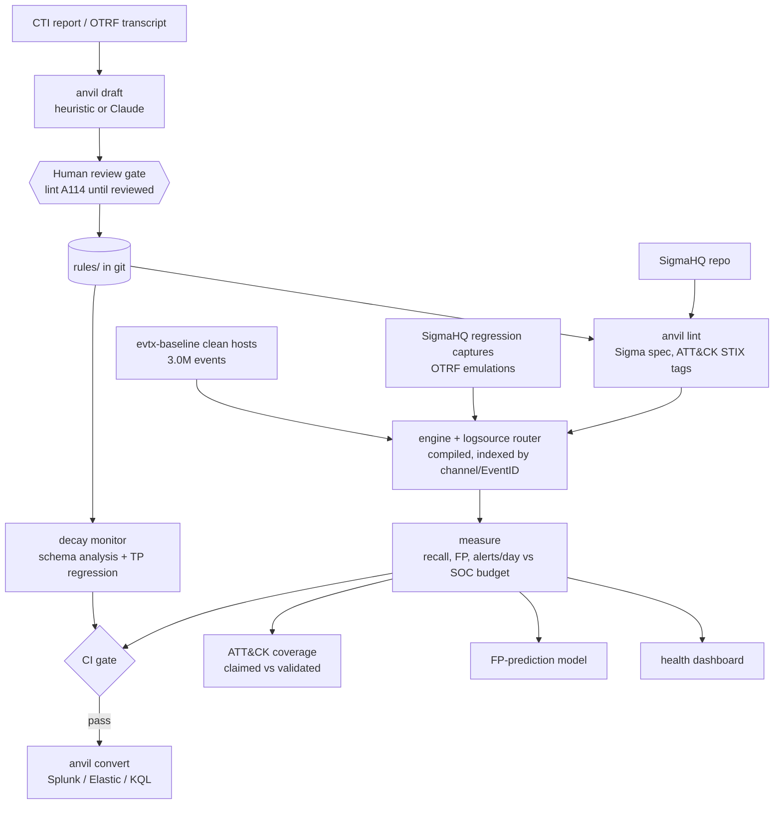

# Architecture

| Module | What it does |
| --- | --- |
| `anvil/engine.py` | Sigma engine: the value/modifier spec (`windash`, `base64offset`, `cidr`, `fieldref`, `re` flags, wildcards/escaping, `\|all`, keywords...), compiled to closures, with Aho-Corasick for large OR-lists. Unsupported features raise instead of mis-evaluating |
| `anvil/logsource.py` | Sigma `logsource` -> Windows channel + EventID (+ EventType guards, 4688 aliasing) |
| `anvil/runner.py`, `parallel.py` | Compile, route and index a whole rule library; multi-process corpus scans |
| `anvil/telemetry.py` | EVTX (pyevtx-rs / python-evtx), EVTX-JSON, OTRF zips and sharded JSONL.gz loaders; `anvil ingest` |
| `anvil/regression.py` | Replays SigmaHQ `regression_data` (real captures labelled with expected match counts) |
| `anvil/harness.py` | Per-rule TP/TN fixtures, FP rate and alerts/day vs SOC capacity (the CI gate) |
| `anvil/lint.py` | Stable finding codes; `anvil` profile (in-rule fixtures) and `sigma` profile (SigmaHQ conventions); stale ATT&CK tags; draft review gate A114 |
| `anvil/attack.py`, `coverage.py` | ATT&CK Enterprise STIX 2.1 catalog; claimed vs validated coverage; Navigator layers |
| `anvil/draft.py` | CTI -> candidate Sigma (heuristic, optional Claude, naive keyword baseline) |
| `anvil/decay.py` | Symbolic per-log-source analysis (ok / degraded / broken / source-missing) and schema-change simulators |
| `anvil/fpmodel.py` | Predicts benign-noisy rules from static features (scikit-learn) |
| `anvil/convert.py` | pySigma bridge: SIEM queries plus an independent SQLite oracle |
| `anvil/dashboard.py` | Static detection-health dashboard |

Design decisions are recorded in [docs/adr](adr/index.md).
