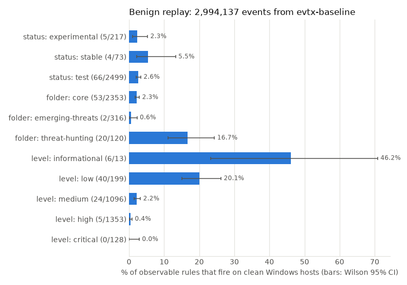
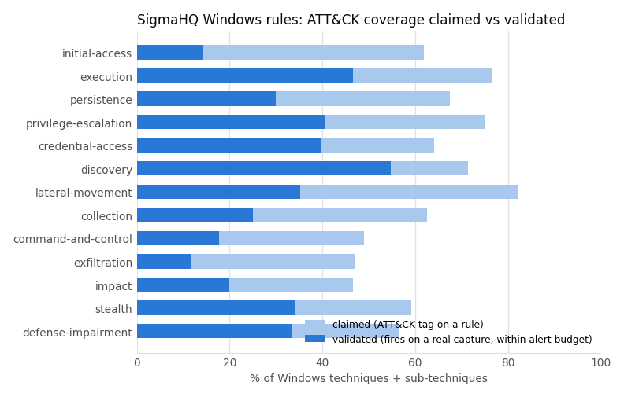
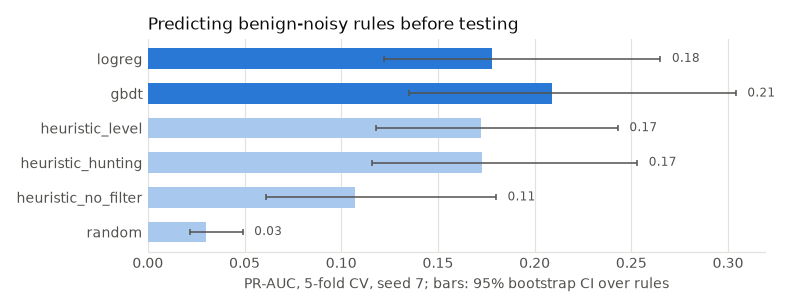

# Benchmarks and results

All numbers below come from `python benchmarks/bench.py all` on the pinned datasets. The full tables are in [results/SUMMARY.md](benchmarks.md#full-summary) and the raw JSON is in [results/](https://github.com/rakshit-737/anvil/tree/main/results). The dashboard is [docs/dashboard.html](dashboard.html).

## 1. Engine fidelity vs baselines (SigmaHQ `regression_data`)

| engine | detected | missed | could not evaluate | detection rate |
| --- | ---: | ---: | ---: | ---: |
| **ANVIL 0.2** | 461 | 0 | 0 | **100.0%** |
| ANVIL 0.1 (frozen baseline, `benchmarks/baselines/engine_v01.py`) | 418 | 14 | 29 | 90.7% |
| pySigma -> SQLite (independent oracle) | 457 | 2 | 2 | 99.1% |

2 of 463 captures were quarantined by local AV and are excluded. ANVIL and the pySigma oracle agree on 457 cases; the two disagreements are cases where SigmaHQ expects a match and only ANVIL produces it. On a 1,800-event benign sample, log-source routing cuts rule evaluations from 5.15M (0.1, every rule sees every event) to 44k and alerts from 164 to 15.

## 2. False positives on clean Windows hosts (evtx-baseline)

2,994,137 events, 2.55 days, 31 shards, 414.6M rule evaluations at ~303 events per CPU-second (pure Python). Policy: a rule may use at most 10% of a 200 alerts/day SOC, i.e. 20/day.

| folder | observable rules | fired | fired % | over budget |
| --- | ---: | ---: | ---: | ---: |
| core | 2,365 | 55 | 2.3% | 5 |
| emerging-threats | 317 | 3 | 0.9% | 1 |
| threat-hunting | 121 | 20 | 16.5% | 6 |

Noisiest rules: *Scheduled Task Created - Registry* (2,161/day), *Shell Context Menu Command Tampering* (1,679/day), *EVTX Created In Uncommon Location* (343/day). No `critical` rule fired, and only 7 of 1,357 `high` rules did. Of the 32 medium+ rules that fired, 27 are already on SigmaHQ's own goodlog `known-FPs.csv`, which is an external check on the replay.

## 3. Emulated attacks (OTRF Security-Datasets) and ATT&CK coverage

| view (Enterprise 19.2, Windows, 474 techniques) | covered | % | parent techniques |
| --- | ---: | ---: | ---: |
| claimed (a rule carries the tag) | 299 | 63.1% | 137/176 |
| validated (a tagged rule fires on a real capture) | 164 | 34.6% | 89/176 |

The OTRF APT29 evaluation captures raise 3,765 (day 1, 111 rules) and 4,723 (day 2, 117 rules) alerts covering 69-70 techniques. Coverage exports as an ATT&CK Navigator layer (`results/navigator_sigmahq_windows.json`).

## 4. Decay monitor under realistic telemetry changes

| simulated change | TP rules that stop firing | flagged statically | recall | precision |
| --- | ---: | ---: | ---: | ---: |
| SIEM pipeline renamed fields to ECS | 428 | 425 | 99% | 100% |
| Sysmon removed, process creation from Security 4688 only | 115 | 110 | 96% | 100% |
| ... and 4688 command-line auditing off | 349 | 110 | 32% | 100% |
| CommandLine field dropped | 234 | 220 | 94% | 100% |

The static analysis needs no attack telemetry. The 4688-without-command-line case is its known weakness: the 4688 schema still defines `CommandLine`, so the symbolic check cannot tell that auditing was switched off. The TP regression replay catches it, but only 16% of the library has TP evidence to replay, which is why both layers exist.

## 5. Drafter (CTI text -> rule -> tested), SIEM conversion, FP prediction

| drafter backend on 98 OTRF descriptions + attacker transcripts | drafts | fires on its own emulation | datasets with benign FPs | benign alerts |
| --- | ---: | ---: | ---: | ---: |
| **heuristic** (process/cmdline/registry extraction) | 90 on 68 datasets | 30 (44%) | 6 | 57 |
| naive keywords (baseline) | 75 on 75 datasets | 55 (73%) | 33 | 126,768 |

The keyword baseline "detects" more but would flood a SOC; the heuristic drafts are quiet but miss more often. Hand-written SigmaHQ rules detect the technique on 47 of the same 68 datasets. That gap is the case for the human review gate.

pySigma conversion of the 2,861 Windows rules: Splunk 99.9%, Elastic 99.8%, SQLite 99.3%, Microsoft XDR KQL 72.5% (751 rules use fields that pipeline cannot map).

FP prediction from static rule features (5-fold CV, 78 noisy of 2,803): logistic regression ROC-AUC 0.84 / PR-AUC 0.20, gradient boosting 0.81 / 0.22, against 0.50 / 0.03 for random. A one-line heuristic (rule `level`) has the same ROC-AUC and better precision at k, so the model is a review-order aid and no more than that.

## Full summary

--8<-- "results/SUMMARY.md"
