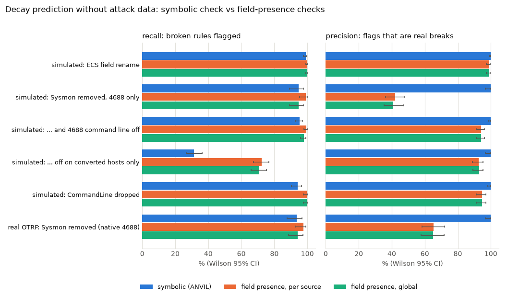

# How it works

One rule's life in ANVIL, step by step. Every step is a CLI command and a CI gate.

## 1. Lint

`anvil lint --rules rules` parses each Sigma rule, checks the condition grammar, modifiers,
regexes, ATT&CK tags and required metadata, and emits finding codes (A1xx). Drafted rules
must carry `reviewed: true`; otherwise A114 blocks them (the human review gate, ADR 0004).

## 2. Route and index

Each rule's `logsource` is mapped to concrete channels and event IDs (`anvil/logsource.py`,
ADR 0002; ADR 0007 adds Linux and AWS). Events are indexed by `(channel, EventID)`, so a
rule is only evaluated against events it can apply to. On an 1,800-event benign sample this
turns 5.15M candidate rule-event evaluations (2,861 rules x 1,800 events) into about 44k;
Evaluation compares the alerts with routing on and off in the same engine.

## 3. True-positive replay

SigmaHQ's own regression captures (one JSON capture per rule) are replayed through the
engine: a rule passes when it matches its capture. This is a recall check on the
development set, not a fidelity proof; the OpenSearch cross-check in CI (see
Evaluation) tests the same rules in a real backend.

## 4. Benign replay and the alert budget

Three clean evtx-baseline hosts are replayed against every observable rule. Hits are
converted to **alerts per host-day** and compared with a budget of 20/day (10% of a
200-alert/day SOC). Rules over budget fail the gate; the fleet-size table in Evaluation
shows how the blocked count grows with the number of hosts.

## 5. Draft, then review

`anvil draft REPORT.md` extracts command lines from a CTI report and writes candidate
rules to `drafts/`. They fail lint until a human sets `reviewed: true`.

## 6. Decay monitoring

When telemetry changes (a Sysmon-to-4688 migration, an ECS rename, a collector dropping a
field), `anvil decay` checks every rule's condition for satisfiability against the
observed per-source field inventory, with no attack data. Evaluation compares this with
field-presence (schema-style) validation and with replay ground truth: simulated changes
applied to SigmaHQ's regression captures, and a real one, OTRF captures replayed with and
without their Sysmon channel. A weekly workflow (`decay.yml`) runs the check and opens an
issue when a rule can no longer fire.

## 7. Claimed vs validated coverage

ATT&CK coverage is reported twice: claimed by tags, and validated by rules that actually
fired on real captures and passed the budget.

