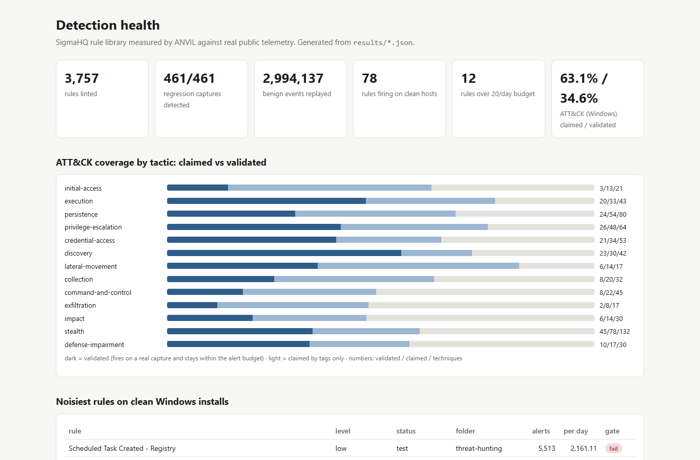

# ANVIL

--8<-- "README.md:pitch"

--8<-- "README.md:headline"

[How it works](how-it-works.md){ .md-button .md-button--primary } [Evaluation](evaluation.md){ .md-button } [Reproduce](reproduce.md){ .md-button } [Dashboard](dashboard.html){ .md-button } [GitHub](https://github.com/rakshit-737/anvil){ .md-button }

--8<-- "README.md:try"
